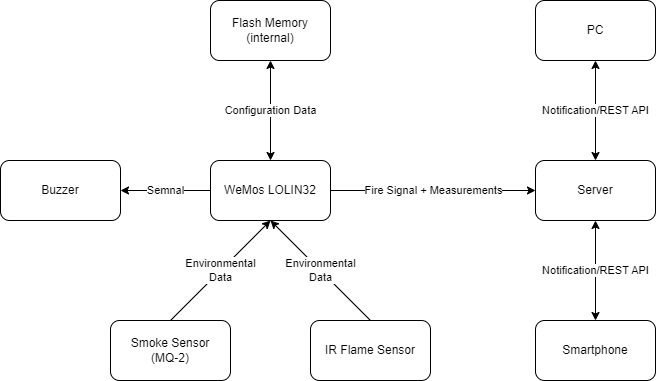
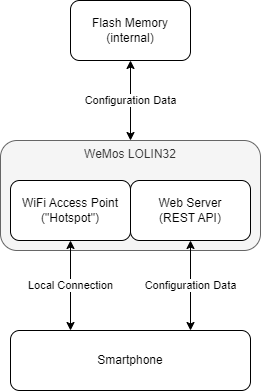
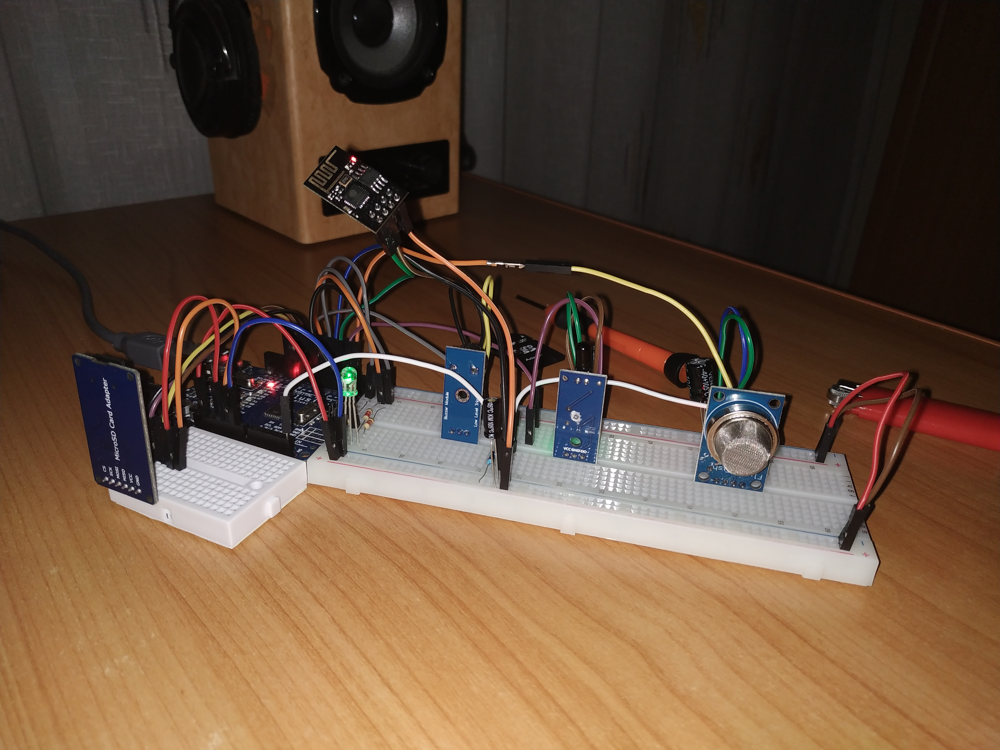
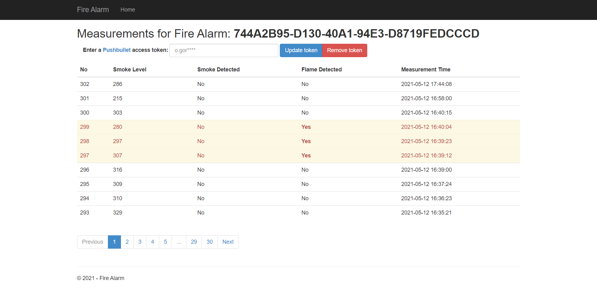
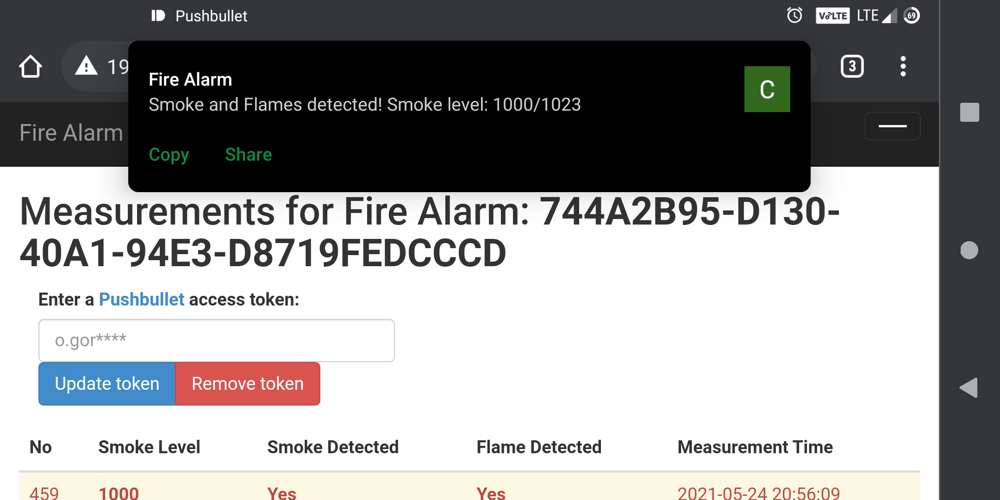
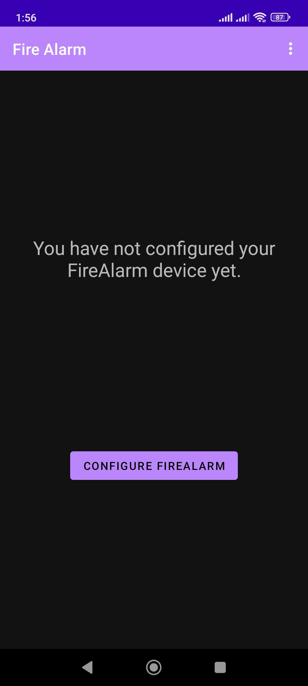
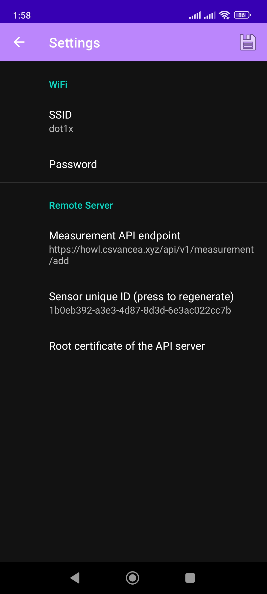
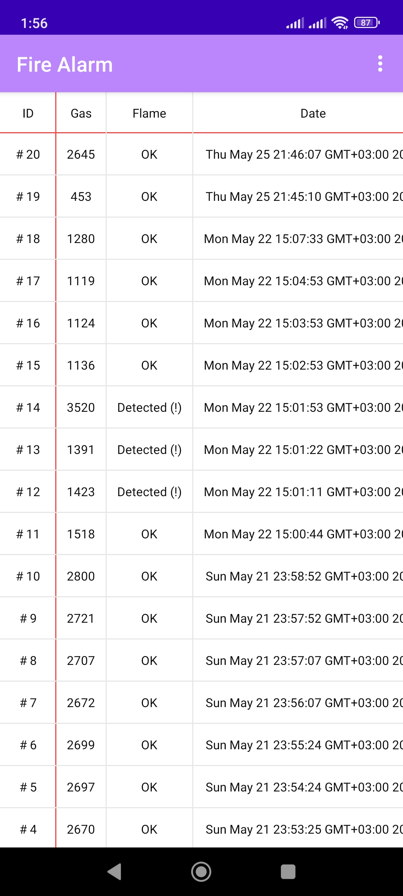

# [Fire Alarm - Internet of Things 2023](https://ocw.cs.pub.ro/courses/iothings/proiecte/2022sric/fire-alarm)

Author: [Cosmin-Răzvan Vancea (SAS1)](csvancea@gmail.com)

## Introduction

- The purpose of this project is to create a smart *FireAlarm*. Upon fire
  detection, the device will collect environmental data from the sensors and
  send it to a remote server, which in turn will notify all the users about the
  incident.
- The FireAlarm also comes with an easy-to-use configuration app, which is
  required to connect the FireAlarm device to a local Wi-Fi network.
- Such a project could prove itself to be extremely helpful. In extreme cases,
  a fire alarm could be a decisive factor for saving lives and goods.

## Overview

- Upon initialization, the microcontroller reads the configuration data from
  its internal flash:
  1. SSID and password of the Wi-Fi network;
  2. URL of a remote server where the measurements must be sent to;
  3. GUID that uniquely identifies the FireAlarm device (this ID is sent along
  with each measurement).
- The RGB led provides feedback to the user:
  - green: the device was able to validate the configuration data and connect
  to the remote server;
  - red: there is valid configuration data stored inside the flash memory, but
  it could not be used to connect to the server (network issue);
  - blue: the device is in configuration mode (happens on the initial startup).
- The microcontroller monitors the pins of the sensors;
- If any sensor reads data that could indicate a fire, the ESP32 would query
  all the sensors and send the data to the remote server. Also, it turns on
  the buzzer alarm;
- The remote server relays the fire signal to each user device that is
  registered for notifications (smartphone, laptop etc).

### Initial Setup/Configuration Mode

If the flash memory is empty or the user holds down the SETUP button while
FireAlarm is starting up, then the device will switch to the configuration mode:

- Wi-Fi starts in AP+STA mode, meaning that it would act as a hotspot;
- a special WebServer is started. It listens to requests made to `192.168.4.1`
(the IP of the FireAlarm on the local hotspot network);
- the WebServer exposes a handful of REST API endpoints used to query and alter
the configuration;
- once a client connects to the Wi-Fi hotspot and pushes a configuration, the
FireAlarm would store it in the internal flash and restart itself to the normal
operation mode.

REST APIs implemented on the microcontroller:

- `GET /api/v1/access-points`: returns a the list of Wi-Fi Access Points
accessible to the FireAlarm device;
- `GET /api/v1/settings`: returns the current configuration of the FireAlarm
device;
- `POST /api/v1/settings`: pushes a new configuration to the FireAlarm device;
- `POST /api/v1/switch-mode`: forces the device to switch to the normal mode;
- `POST /api/v1/ping`: echoes back the request. Useful to determine whether we
are connected to a FireAlarm device.

## Hardware Design

### Components

1. [WeMos LOLIN32](https://cleste.ro/placa-dezvoltare-esp-wroom-32-esp-32s.html)
2. [MQ-2 Gas Sensor Module](https://www.optimusdigital.ro/en/gas-sensors/107-mq-2-gas-sensor-module.html)
3. [IR Flame Sensor](https://www.optimusdigital.ro/en/optical-sensors/110-ir-flame-sensor.html)
4. [Active Buzzer Module](https://www.optimusdigital.ro/en/buzzers/10-active-buzzer-module.html)
5. [RGB LED Common Cathode](https://www.optimusdigital.ro/en/leds/483-rgb-led-common-cathode.html)
6. [Resistors (3x 2.2k)](https://www.optimusdigital.ro/en/kits/4745-optimus-digital-resistor-assortment-kit-10-to-1m-600pcs-0616639927610.html)
7. [Capacitors (1x 47uF)](https://www.optimusdigital.ro/en/capacitors/1880-electrolytic-condenser-from-10-uf-to-63-v.html)
8. [Breadboard](https://www.optimusdigital.ro/en/breadboards/8-breadboard-hq-830-points.html)

### Electronic Schematics

## Software Design

### General Information

We will only focus on the microcontroller software.

The project is comprised of three main software components:

1. [ESP32 Software](fire-alarm):
  communicates with the sensors and sends the measurements to the remote server;
2. [Remote Server](howl):
  processes and stores the measurements; notifies the registered devices;
  provides a web interface for visualizing the data;
3. [Android Companion App](https://github.com/csvancea/howl-android):
  consumes the configuration API and provides a human interface for setting up
  the FireAlarm device; can also be used to visualize the data sent to the
  remote server.

We will only focus on the microcontroller software.

### ESP32 Software

The code is split into multiple "modules":

- `SettingsManager`: manages the configuration data
  - provides a mechanism for serializing and unserializing the data;
  - provides an interface for reading and writing the configuration from/to
  the flash storage.
- `NetManager`: manages the Wi-Fi operation mode (station or client). Branches
down further in two modules:
  - `NetClient`: the FireAlarm device acts as a client
    - provides a mechanism for connecting to a remote web server through HTTPs;
    - can only POST data (measurements).
  - `NetConfigAP`: the FireAlarm device acts as a station ("Hotspot")
    - implements a WebServer;
    - the WebServer handles a series of REST API endpoints (explained above);
    - can temporarily switch the Wi-Fi module to station mode in order to scan
    for other APs.
- `(Flame|Gas)Sensor`: abstraction layer for the sensors
  - can register an interrupt on a pin;
  - invokes a callback each time an interruption is raised (the value on the pin
  changed);
  - provides a mechanism for reading the sensor.
- `Led`: abstraction layer for a 4-pin RGB led
  - provides a way to change the color, intensity, blinking rate etc
- `Buzzer`: abstraction layer
- `FireAlarm`: puts together the components above; responsible for the general
logic of the program.

### 3rd-party Libraries

Moreover, the following 3rd-party libraries are used:

- [ArduinoJson](https://arduinojson.org/): JSON serializer/deserializer. Used
for communicating through REST APIs and storing the configuration as a text
file.
- [EasyButton](https://reference.arduino.cc/reference/en/libraries/easybutton/):
abstraction layer for push buttons. Provides a debouncing mechanism and invokes
a user-defined callback on button press.

### Interrupts

During a network operation, the device might appear unresponsive due to the main
`loop()` being busy processing the network request. In order to increase the
responsiveness of the FireAlarm device, **interrupts** are being used: each time
a sensor value changes, an interrupt is raised. The interrupt handler marks the
event for further processing in the main loop and changes the state of the
buzzer (on/off) so that the alarm appears to be responsive to the nearby people.

### Server

The server software is written in [Flask](https://flask.palletsprojects.com/en/1.1.x/).
It is basically a web server that:

- exposes an REST API endpoint for the ESP32 to post measurements to. Note that
each POST request must contain the GUID of the FireAlarm, otherwise the server
would not be able to tell different devices apart;
- provides a web interface for reading the measurement. The user must know the
FireAlarm GUID.

The alarm notification is served though [PushBullet](https://pushbullet.com/).
For the notification mechanism to actually work, the user must associate a
PushBullet token to their FireAlarm GUID. This operation can be done though the
web interface.

### Android Companion App

Written in Java. It is basically a client that consumes both the API provided
by the ESP32 (when in configuration mode) and the API provided by the remote
web server.

The app provides a step-by-step tutorial on how to configure the FireAlarm.
After the configuration is done, the app stores locally the assigned GUID of
the FIreAlarm device so that the users are not needed to remember the GUID
themselves.

## Results

### FireAlarm Prototype

### Web Interface

### Android Companion App

  

## Conclusion

It was a challenging and productive experience because I had to approach the
project from three different perspectives: a local system that collects data
from sensors; a remote system that receives and processes measurements from
multiple devices; and a hybrid system that must communicate to both the local
system (through a local network/"Hotspot") and to the remote system (through
the Internet).

## Resources

- [ESP32 Arduino Core’s documentation](https://docs.espressif.com/projects/arduino-esp32/en/latest/)
- [Arduino ESP-32 Wi-Fi API](https://espressif-docs.readthedocs-hosted.com/projects/arduino-esp32/en/latest/api/wifi.html)
- [Arduino ESP-32 WebServer library source code](https://github.com/espressif/arduino-esp32/tree/master/libraries/WebServer/src)
- [ArduinoJson](https://arduinojson.org/)
- [EasyButton](https://reference.arduino.cc/reference/en/libraries/easybutton/)
- [Flask Documentation](https://flask.palletsprojects.com/_/downloads/en/1.1.x/pdf/)
- [PushBullet API Documentation](https://docs.pushbullet.com/)
- [Android API reference](https://developer.android.com/reference)
- [TableView for Android](https://github.com/evrencoskun/TableView)
